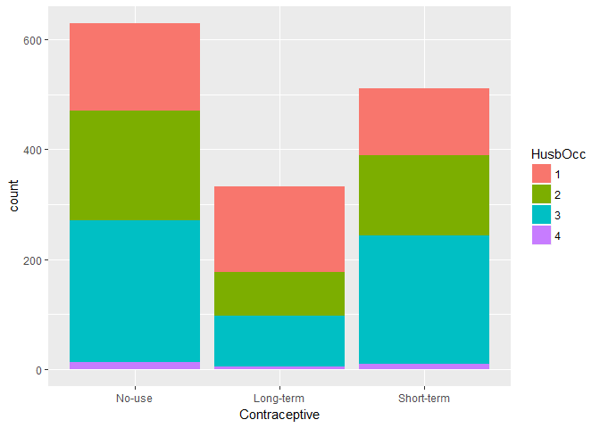
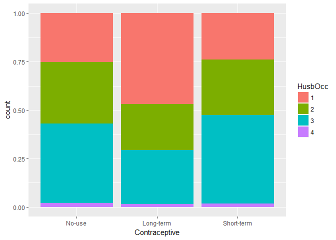
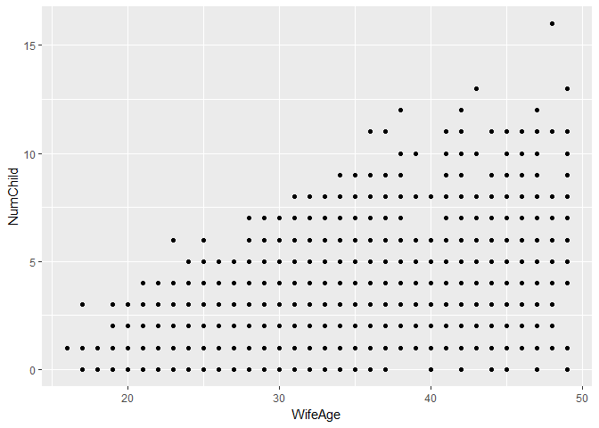
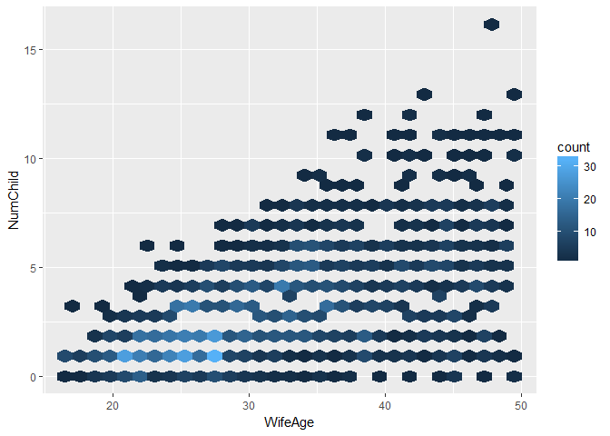
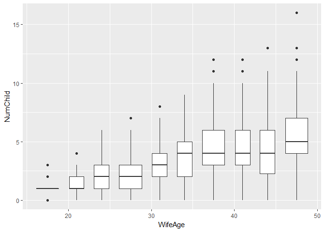
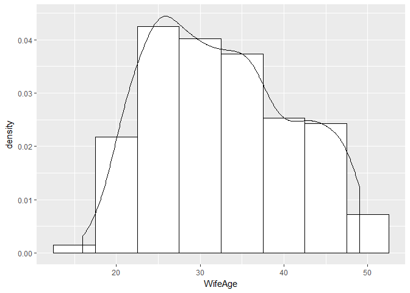

N741: Exploratory Data Analysis
================
Melinda K. Higgins, PhD.
January 30, 2017

Initial R Chunk - document and environment setup
------------------------------------------------

HELPUL Links for Graphics and EDA
---------------------------------

Here are some helpful links for doing EDA in R and Associated Graphics:

-   <http://www.cookbook-r.com/Graphs/>
-   [Quick-R Website](http://www.statmethods.net/)
-   [EDA Chapter in "R for Data Science"](http://r4ds.had.co.nz/exploratory-data-analysis.html)
-   [Code Examples from Practical Data Science with R - see Chapter 3](https://github.com/WinVector/zmPDSwR/tree/master/CodeExamples)

Setup `CMC` dataset from UCI Data Repository
--------------------------------------------

The following dataset comes from the [UCI Data Repository](http://archive.ics.uci.edu/ml/). The dataset we'll use is the Contraceptive Method Choice dataset. The information on this dataset is provided at <http://archive.ics.uci.edu/ml/datasets/Contraceptive+Method+Choice>. If you click on the "Data Folder" you can download the RAW data `cmc.data` which is a comma delimited format dataset (i.e. it is a CSV formatted file) and the description of the data included, the variable names and associated codes for the values included which is in the `cmc.names` file. See "Data Folder"" at <http://archive.ics.uci.edu/ml/machine-learning-databases/cmc/>

### Read-in data

**NOTE:** Download the 2 files from the UCI Data Repository for the Contraceptive Method Choice and put them in the directory where you have this RMD `rmarkdown` file.

``` r
# read in the comma delimited (CSV) formatted dataset
# **NOTE**: This dataset does NOT have the column
# names as the 1st row of the file. We will assign the 
# column names below.
cmc <- read_csv("cmc.data", col_names=FALSE)
```

    ## Parsed with column specification:
    ## cols(
    ##   X1 = col_integer(),
    ##   X2 = col_integer(),
    ##   X3 = col_integer(),
    ##   X4 = col_integer(),
    ##   X5 = col_integer(),
    ##   X6 = col_integer(),
    ##   X7 = col_integer(),
    ##   X8 = col_integer(),
    ##   X9 = col_integer(),
    ##   X10 = col_integer()
    ## )

### Apply the codebook - variable names and coding used

Apply variable names to the 10 columns of data in `cmc`.

``` r
# assign new variables names to the 10 columns
names(cmc) <- c("WifeAge", "WifeEd", "HusbEd", "NumChild",
                "WifeRel", "WifeWork", "HusbOcc", "SOLindex", 
                "Media", "Contraceptive")
```

The next code chunk is to add the labels for "factor" levels for some of the variables (i.e. we are creating factors).

**WARNING**: Notice I'm overwriting the variables and changing them from integers to factors which have different properties as you'll see below. If you want to keep the original integer variables, you could simply give the new facotr variable a new name. For example you could write

    cmc$WifeEd.f <- factor(cmc$WifeEd,
                           levels = c(1,2,3,4),
                           labels = c("low","med low","med

and this would append a new column onto the `cmc` dataset that is the "factor" type version of Wife's Education. For now, use the code below to update all of the variables.

``` r
# update Wife Education as a factor, assign the 
# levels and the labels for each level
cmc$WifeEd <- factor(cmc$WifeEd,
                     levels = c(1,2,3,4),
                     labels = c("low","med low","med high","high"))

# do the remaining variables
cmc$HusbEd <- factor(cmc$HusbEd,
                     levels = c(1,2,3,4),
                     labels = c("low","med low","med high","high"))

cmc$WifeRel <- factor(cmc$WifeRel,
                      levels = c(0,1),
                      labels = c("Non-Islam","Islam"))

# Note: The documentation does state that
# 0=yes and 1=no which seems incorrect...
cmc$WifeWork <- factor(cmc$WifeWork,
                       levels = c(0,1),
                       labels = c("Yes","No"))

cmc$HusbOcc <- factor(cmc$HusbOcc,
                      levels = c(1,2,3,4),
                      labels = c("1","2","3","4"))

cmc$SOLindex <- factor(cmc$SOLindex,
                       levels = c(1,2,3,4),
                       labels = c("low","med low","med high","high"))

cmc$Media <- factor(cmc$Media,
                    levels = c(0,1),
                    labels = c("Good","Not Good"))

cmc$Contraceptive <- factor(cmc$Contraceptive,
                            levels = c(1,2,3),
                            labels = c("No-use","Long-term","Short-term"))
```

### Save a copy of the `cmc` dataset

The `save()` command will save a copy of your dataset (the `cmc` object) as an `.RData` file which is easily read by R. The associated command to then read the data back in is the `load()` command. This will be helpful shortly when we run the demo in "R Commander" (`Rcmdr` package).

``` r
# save the cmc dataset with the updated variable names
# and associated factor levels and labeling applied.
save(cmc, file="cmc.RData")
```

### Look at a subset of the data

``` r
head(cmc)
```

    ## # A tibble: 6 × 10
    ##   WifeAge   WifeEd   HusbEd NumChild WifeRel WifeWork HusbOcc SOLindex
    ##     <int>   <fctr>   <fctr>    <int>  <fctr>   <fctr>  <fctr>   <fctr>
    ## 1      24  med low med high        3   Islam       No       2 med high
    ## 2      45      low med high       10   Islam       No       3     high
    ## 3      43  med low med high        7   Islam       No       3     high
    ## 4      42 med high  med low        9   Islam       No       3 med high
    ## 5      36 med high med high        8   Islam       No       3  med low
    ## 6      19     high     high        0   Islam       No       3 med high
    ## # ... with 2 more variables: Media <fctr>, Contraceptive <fctr>

### Print this subset using `knitr::kable()`

``` r
knitr::kable(head(cmc))
```

|  WifeAge| WifeEd   | HusbEd   |  NumChild| WifeRel | WifeWork | HusbOcc | SOLindex | Media | Contraceptive |
|--------:|:---------|:---------|---------:|:--------|:---------|:--------|:---------|:------|:--------------|
|       24| med low  | med high |         3| Islam   | No       | 2       | med high | Good  | No-use        |
|       45| low      | med high |        10| Islam   | No       | 3       | high     | Good  | No-use        |
|       43| med low  | med high |         7| Islam   | No       | 3       | high     | Good  | No-use        |
|       42| med high | med low  |         9| Islam   | No       | 3       | med high | Good  | No-use        |
|       36| med high | med high |         8| Islam   | No       | 3       | med low  | Good  | No-use        |
|       19| high     | high     |         0| Islam   | No       | 3       | med high | Good  | No-use        |

Summarise Dataset - Descriptive Stats
-------------------------------------

**NOTICE** that Wife's Age and Number of Children are now the only "numeric" "integer" variables - these are the only ones for which we get summary statistics. All the remaining variables are "factors" so we only get the frequencies for each category.

``` r
summary(cmc)
```

    ##     WifeAge           WifeEd         HusbEd       NumChild     
    ##  Min.   :16.00   low     :152   low     : 44   Min.   : 0.000  
    ##  1st Qu.:26.00   med low :334   med low :178   1st Qu.: 1.000  
    ##  Median :32.00   med high:410   med high:352   Median : 3.000  
    ##  Mean   :32.54   high    :577   high    :899   Mean   : 3.261  
    ##  3rd Qu.:39.00                                 3rd Qu.: 4.000  
    ##  Max.   :49.00                                 Max.   :16.000  
    ##       WifeRel     WifeWork   HusbOcc     SOLindex        Media     
    ##  Non-Islam: 220   Yes: 369   1:436   low     :129   Good    :1364  
    ##  Islam    :1253   No :1104   2:425   med low :229   Not Good: 109  
    ##                              3:585   med high:431                  
    ##                              4: 27   high    :684                  
    ##                                                                    
    ##                                                                    
    ##     Contraceptive
    ##  No-use    :629  
    ##  Long-term :333  
    ##  Short-term:511  
    ##                  
    ##                  
    ## 

### Computing stats on factors

Suppose you wanted to know the mean education level of the Huband's in this dataset. We can use the `as.numeric()` function to convert the variable and then run a `mean()` on it. We'll do more on facotrs later this semester.

``` r
mean(as.numeric(cmc$HusbEd))
```

    ## [1] 3.429735

### Cleaning up your tables & Improving Workflow with PIPES (`%>%`)

The following code shows:

1.  how to improve your workflow and readability of your code using "pipes" `%>%`
2.  how to add multiple statistics per variable
3.  and how to output these multiple stats by group for a given variable

``` r
# these lines of code use the %>% "pipe" command.
# It also uses the group_by() function
# also in the dplyr package. The lines below can be read as
# "take the XXX (cmc) dataset, THEN summarise the
# sample size and sample mean.

# initial steps
cmc %>%
    summarise(nChild = length(NumChild),
              meanChild = mean(NumChild))
```

    ## # A tibble: 1 × 2
    ##   nChild meanChild
    ##    <int>     <dbl>
    ## 1   1473  3.261371

``` r
# look at output - figure out number of columns, add knitr::kable()
# put in good column names (2 columns) and a TITLE using caption
cmc %>%
    summarise(nChild = length(NumChild),
              meanChild = mean(NumChild)) %>%
  knitr::kable(col.names=c("N","mean"),
                 caption="Number of Children: Descriptive Stats")
```

|     N|      mean|
|-----:|---------:|
|  1473|  3.261371|

``` r
# let's add more descriptive stats to our table
# this means we now have more columns - one per stat
cmc %>%
    summarise(nChild = length(NumChild),
              minChild = min(NumChild),
              meanChild = mean(NumChild),
              sdChild = sd(NumChild),
              medianChild = median(NumChild),
              maxChild = max(NumChild)) %>%
    knitr::kable(col.names=c("N","min",
                             "mean","sd","median","max"),
                 caption="Number of Children: Descriptive Stats")
```

|     N|  min|      mean|        sd|  median|  max|
|-----:|----:|---------:|---------:|-------:|----:|
|  1473|    0|  3.261371|  2.358549|       3|   16|

``` r
# let's do again but BY Wife's Religion (2 groups)
# group the data BY
# each continent THEN summarise each continent's mean and sd."
# I THEN sent the output to the kable function to output
# there is one more column now for Wife's Religion.
cmc %>%
    group_by(WifeRel) %>%
    summarise(nChild = length(NumChild),
              minChild = min(NumChild),
              meanChild = mean(NumChild),
              sdChild = sd(NumChild),
              medianChild = median(NumChild),
              maxChild = max(NumChild)) %>%
    knitr::kable(col.names=c("Wife Religion","N","min",
                             "mean","sd","median","max"),
                 digits = 2,
                 caption="Number of Children: Stats by Wife Religion")
```

| Wife Religion |     N|  min|  mean|    sd|  median|  max|
|:--------------|-----:|----:|-----:|-----:|-------:|----:|
| Non-Islam     |   220|    0|  2.85|  1.80|       3|   11|
| Islam         |  1253|    0|  3.33|  2.44|       3|   16|

Exploratory Graphics and Visualizations
---------------------------------------

### Learning `ggplot2` as the Core Visualization tool in R

The following code uses the `ggplot2` package which is included with the `tidyverse` package already loaded above. So, we do not need to reload the `ggplot2` package.

The way the `ggplot2` workflow typically works is to call the `ggplot()` command, declare the dataset to be used and specify "aesthetics" - which are usually the "x" and "y" variables for univariate and bivariate graphics respectively. After calling the `ggplot()` command and providing the basic parameters, you then add `+` "geom's" or "geometric objects" that can be layered to create some spectactular graphics and visualizations.

**NOTE**: You can learn more about the `ggplot2` package at:

-   `ggplot2` pages at "tidyverse.org" <http://ggplot2.tidyverse.org/>
-   Chapter 3 "Data Visualization" in the "R for Data Science" book <http://r4ds.had.co.nz/data-visualisation.html>
-   Chapter 28 "Graphics for Communication" in the "R for Data Science" book <http://r4ds.had.co.nz/graphics-for-communication.html>
-   RStudio Cheatsheets - see "Data Visualization with `ggplot2`" <https://www.rstudio.com/resources/cheatsheets/>

### Bi-Variate Categorical Data - Make a Clustered Bar plot with `ggplot2`

We will used `ggplot()` with the `geom_bar()` layer to make a clustered bar chart for Contraceptive Use ("x") by Husband's Occupation ("fill") for the `cmc` dataset. Within the `geom_bar()` layer, there are 3 possible settings for the `position=` option: "dodge", "stack" and "fill" - each one gives you a different perspective of the relative counts or proportions for a categorical outcome.

First, let's use the "dodge" option. This will plot the absolute counts for each of the 3 Contraceptive Use choices with the bars colored by the 4 possible Husband Occupation categories. Remember - these are absolute counts NOT proportions.

``` r
ggplot(cmc, aes(x=Contraceptive, fill=HusbOcc)) + 
  geom_bar(position='dodge')
```


Next, let's use the "stack" option. This gives a better idea of the relative proportions of the 4 Husband Occupation categories WITHIN each of the 3 Contraceptive Use categories. But the "stack" heights show the absolute counts of each Contraceptive Use Choice category.

``` r
ggplot(cmc, aes(x=Contraceptive, fill=HusbOcc)) + 
  geom_bar(position='stack')
```



Finally, use the "fill" option. This one also "stacks" the relative proportions of the 4 Husband Occupation categories WITHIN each of the 3 Contraceptive Use categories. But now each Contraceptive Use Category is re-scaled to 100% - so this plot gives you an idea of the relative %'s of Husband's Occupation WITHIN Contraceptive Use Category.

``` r
ggplot(cmc, aes(x=Contraceptive, fill=HusbOcc)) + 
  geom_bar(position='fill')
```



### Bi-variate ~Continuous/Numerical Data - Scatterplot of Wife's Age and Number of Children

**NOTE:** Remember there are 1473 subjects in this dataset.

This time we will use the `geom_point()` layer to make a scatterplot.

``` r
cmc %>%
  ggplot(aes(x=WifeAge, y=NumChild)) +
    geom_point()
```



This obviously has a lot of overplotting (points on top of one another). One way to alleviate this issue is to add "jitter" as the `position=` option within the `geom_point()` command. This adds a little bit of randomness so the points won't lie on top of one another - helps alleviate overplotting.

``` r
cmc %>%
  ggplot(aes(x=WifeAge, y=NumChild)) +
    geom_point(position = "jitter")
```


Still another way to handle the overplotting issue is to "bin" the data in 2 dimensions. This is helpful when there are a lot of points in a scatterplot. So, we will use the `geom_hex()` layer (instead of `geom_point()`) which basically does a density plot using 2-D bins like a 2-D histogram in a way.

``` r
cmc %>%
  ggplot(aes(x=WifeAge, y=NumChild)) +
    geom_hex()
```



### Categorical and Numerical Data - Boxplots & Options

For the plots below, we will use the `geom_boxplot()` option and make boxplots for the Number of Children by the Wife's Age. This time, we'll "bin" the Wife's Age in a couple of different ways.

First, let's bin the Wife's Age in 5 year increments. This uses the `cut_width()` option.

``` r
cmc %>%
  ggplot(aes(x=WifeAge, y=NumChild)) +
    geom_boxplot(aes(group=cut_width(WifeAge, 5)))
```


Now, let's "bin" the Wife's Age into 10 equal intervals across the range of ages. This uses the `cut_interval()` options.

``` r
cmc %>%
  ggplot(aes(x=WifeAge, y=NumChild)) +
    geom_boxplot(aes(group=cut_interval(WifeAge, 10)))
```



We could also "bin" the Wife's age by the number of subjects in each "bin" - so, let's make 6 "bins" that have about the same number of people in them. This uses the `cut_number()` option. Notice that the youngest and oldest "bins" are wider since there are fewer people at either end - thus the "bins" have to be wider to have the same number of people.

``` r
cmc %>%
  ggplot(aes(x=WifeAge, y=NumChild)) +
    geom_boxplot(aes(group=cut_number(WifeAge, 6)))
```


### Numeric/Continuous Univariate Data - Histograms and Density estimates of Continuous Data

Let's look at Wife's Age and Number of Children - do you expect these to look normal?

see more at <http://www.cookbook-r.com/Graphs/Plotting_distributions_(ggplot2)/>

For this example, we will use BOTH the `geom_histogram()` and `geom_density()` layers.

**NOTE:** In `geom_histogram()` we have a *wierd* looking option `aes(y=..density..)` - this option sets the vertical ("Y") axis for this histogram to be the same as it will be for the density plot - both plots have to use the proportion scale and NOT the raw counts (which is tghe default for histograms).

``` r
cmc %>%
  ggplot(aes(WifeAge)) +
    geom_histogram(aes(y=..density..),
                   colour="black",fill="white",
                   binwidth=5) +
    geom_density()
```



Here is a slight tweak with the histogram bars in one color and the density curve overlaid using a different color with a transparency setting `alpha=.2` showing the utility of `ggplot2` and building visually appealing layers for detailed data visualizations.

``` r
cmc %>%
  ggplot(aes(WifeAge)) +
    geom_histogram(aes(y=..density..),
                   colour="black",fill="yellow",
                   binwidth=5) +
    geom_density(alpha=.2, fill="blue")
```


What about overlaying a Normal Curve? Here we use the `stat_function()` to draw a normal curve over the histogram for quick comparison. The code also includes the `labs()` layer for adding customized axis labels and a title.

``` r
cmc %>%
  ggplot(aes(WifeAge)) +
    geom_histogram(aes(y=..density..),
                   colour="black",fill="yellow",
                   binwidth=5) + 
    stat_function(fun = dnorm, 
                  args = list(mean = mean(cmc$WifeAge), 
                              sd = sd(cmc$WifeAge)), 
                  lwd = 1, 
                  col = 'red') +
  labs(title = "Distribution of Wife's Age",
       x = "Wife's Age",
       y = "Density")
```


